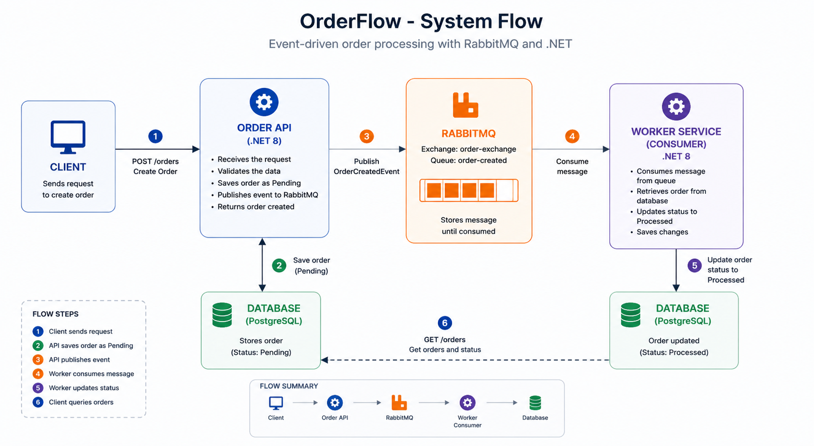

# AsyncOrders

A production-ready reference implementation of asynchronous order processing using .NET 8, RabbitMQ, and PostgreSQL — built with Clean Architecture, Domain-Driven Design (DDD), and SOLID principles.

---

## Overview

AsyncOrders demonstrates how to decouple a write API from its processing logic using a message queue. The API accepts orders and immediately returns to the caller; a separate Worker Service consumes those events and updates the database asynchronously.



## Architecture

The solution is structured in layers following Clean Architecture — dependencies always point inward.

```
src/
├── Order.Domain/          # Core business logic — no external dependencies
│   ├── Entities/          # Order entity with domain behavior (Create, MarkAsProcessed)
│   └── Interfaces/        # IOrderRepository contract
│
├── Order.Application/     # Use cases and application contracts
│   ├── UseCases/          # CreateOrderUseCase, ProcessOrderUseCase, GetOrders*, GetOrderById*
│   ├── DTOs/              # Request/response models
│   ├── Interfaces/        # IMessagePublisher contract
│   └── Messages/          # OrderCreatedMessage (RabbitMQ payload)
│
├── Order.Infrastructure/  # External concerns — implements Application contracts
│   ├── Persistence/       # EF Core DbContext, repository, migrations, entity config
│   ├── Messaging/         # RabbitMqPublisher
│   └── Settings/          # RabbitMqSettings (bound from appsettings)
│
├── Order.Api/             # ASP.NET Core entry point
│   └── Controllers/       # OrdersController — delegates to use cases
│
└── Order.Worker/          # Worker Service entry point
    └── OrderConsumer.cs   # BackgroundService — consumes queue, calls ProcessOrderUseCase
```

### SOLID in practice

| Principle | Applied as |
|-----------|-----------|
| **SRP** | Each `UseCase` has exactly one responsibility |
| **OCP** | `IMessagePublisher` allows swapping brokers without touching Application or Domain |
| **LSP** | `OrderRepository` fulfills `IOrderRepository` without changing behavior |
| **ISP** | `IOrderRepository` and `IMessagePublisher` are small, focused contracts |
| **DIP** | Domain and Application depend on abstractions; Infrastructure provides implementations |

---

## Tech Stack

| Component | Technology |
|-----------|-----------|
| Runtime | .NET 8 |
| API | ASP.NET Core Web API |
| Worker | .NET Worker Service |
| Message broker | RabbitMQ 3 (`RabbitMQ.Client` 6.x) |
| Database | PostgreSQL 16 (via Npgsql) |
| ORM | Entity Framework Core 8 |
| API docs | Swashbuckle / Swagger |
| Infrastructure | Docker Compose |

---

## Prerequisites

- [.NET 8 SDK](https://dotnet.microsoft.com/download/dotnet/8.0)
- [Docker Desktop](https://www.docker.com/products/docker-desktop)

---

## Getting Started

### 1. Start infrastructure

```bash
docker compose up -d
```

Starts RabbitMQ and PostgreSQL as Docker containers.

### 2. Configure your environment

Copy and fill in your local settings:

```bash
cp src/Order.Api/appsettings.json src/Order.Api/appsettings.Development.json
cp src/Order.Worker/appsettings.json src/Order.Worker/appsettings.Development.json
```

Edit both `appsettings.Development.json` files — see [Configuration](#configuration) below.  
These files are in `.gitignore` and will never be committed.

### 3. Restore packages

```bash
dotnet restore
```

### 4. Run the API (terminal 1)

```bash
dotnet run --project src/Order.Api
```

Database migrations are applied automatically on startup.  
Swagger UI: **http://localhost:5000/swagger**

### 5. Run the Worker (terminal 2)

```bash
dotnet run --project src/Order.Worker
```

---

## Configuration

Both `Order.Api` and `Order.Worker` share the same configuration keys.

### `appsettings.json` (committed — placeholders only)

```json
{
  "ConnectionStrings": {
    "DefaultConnection": "Host=YOUR_HOST;Port=5432;Database=YOUR_DATABASE;Username=YOUR_USER;Password=YOUR_PASSWORD"
  },
  "RabbitMQ": {
    "Host": "YOUR_RABBITMQ_HOST",
    "Username": "YOUR_RABBITMQ_USER",
    "Password": "YOUR_RABBITMQ_PASSWORD"
  }
}
```

### `appsettings.Development.json` (local only — never committed)

Fill in with your actual values. For local Docker Compose:

```json
{
  "ConnectionStrings": {
    "DefaultConnection": "Host=localhost;Port=5432;Database=asyncordersdb;Username=postgres;Password=postgres"
  },
  "RabbitMQ": {
    "Host": "localhost",
    "Username": "guest",
    "Password": "guest"
  }
}
```

> ASP.NET Core automatically merges `appsettings.Development.json` on top of `appsettings.json`
> when the environment is `Development` — the values override the placeholders.

---

## API Endpoints

| Method | Route | Description |
|--------|-------|-------------|
| `POST` | `/orders` | Create a new order |
| `GET` | `/orders` | List all orders |
| `GET` | `/orders/{id}` | Get order by ID |

### Request example

```http
POST /orders
Content-Type: application/json

{
  "customerName": "John Doe",
  "productName": "Mechanical Keyboard",
  "amount": 249.99
}
```

### Response example

```json
{
  "id": "3fa85f64-5717-4562-b3fc-2c963f66afa6",
  "customerName": "John Doe",
  "productName": "Mechanical Keyboard",
  "amount": 249.99,
  "status": "Pending",
  "createdAt": "2024-06-01T12:00:00Z",
  "processedAt": null
}
```

After ~3 seconds the Worker updates the record and `status` becomes `"Processed"`.

---

## RabbitMQ Management UI

**http://localhost:15672** — default credentials: `guest` / `guest`

Navigate to **Queues → order-created** to inspect message activity in real time.

---

## Database Migrations

Migrations live in `Order.Infrastructure/Migrations/` and run automatically on API startup.

To add a new migration manually:

```bash
dotnet ef migrations add <MigrationName> \
  --project src/Order.Infrastructure \
  --startup-project src/Order.Api

dotnet ef database update \
  --project src/Order.Infrastructure \
  --startup-project src/Order.Api
```

---

## Potential Improvements

- **Outbox pattern** — guarantee atomicity between saving the order and publishing the event
- **Dead-letter queue (DLQ)** — route failed messages for inspection instead of discarding them
- **Retry policy** — add Polly for transient fault handling on RabbitMQ and database calls
- **Health checks** — expose `/health` endpoints for both API and Worker
- **Structured logging** — integrate Serilog with console/file/seq sinks
- **Containerize API and Worker** — add Dockerfiles and include all services in `docker-compose.yml`
- **Integration tests** — use Testcontainers to spin up real PostgreSQL and RabbitMQ in CI

---

## License

MIT
